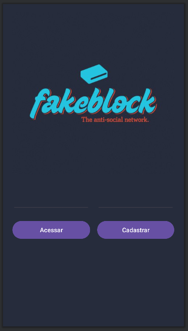
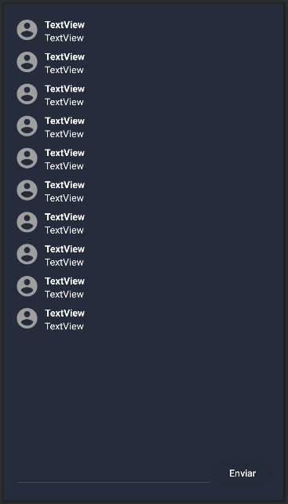

# FakeBlock - Rede anti-social

## Funcionalidades

- Recurso 1: Autenticação por e-mail e senha.
- Recurso 2: Sala de bate-papo, chat em grupo.

## Planned features
###### Recursos planejados

- Recurso 1: Criar publicação (post).
- Recurso 2: Comentar na publicação.
- Recurso 3: Publicação recente.
- Recurso 4: Principais publicação.

## Descrição

O FakeBlock é um aplicativo de chat que permite aos usuários se conectarem e participarem da sala de bate-papo em grupo. Ele oferece recursos de autenticação por e-mail e senha, além de proporcionar uma experiência de comunicação em tempo real com outros usuários.

### Autenticação

Autenticação por e-mail e senha
Os usuários podem criar uma conta usando seu endereço de e-mail e senha. Isso garante a segurança e privacidade das informações pessoais de cada usuário.

### Sala de bate-papo em grupo

Após autenticar-se, os usuários têm acesso a unica salas de bate-papo disponíveis. O chat em grupo permite o envio de mensagens, proporcionando uma experiência de comunicação.

## Capturas de tela do aplicativo:
---
#### Tela de Login e Chat

---

_Reinventing the wheel, learning Android mobile development._

_* Arrested Development_

<!-- https://github.com/jirawatee/FirebaseRealtimeDatabase-Android -->